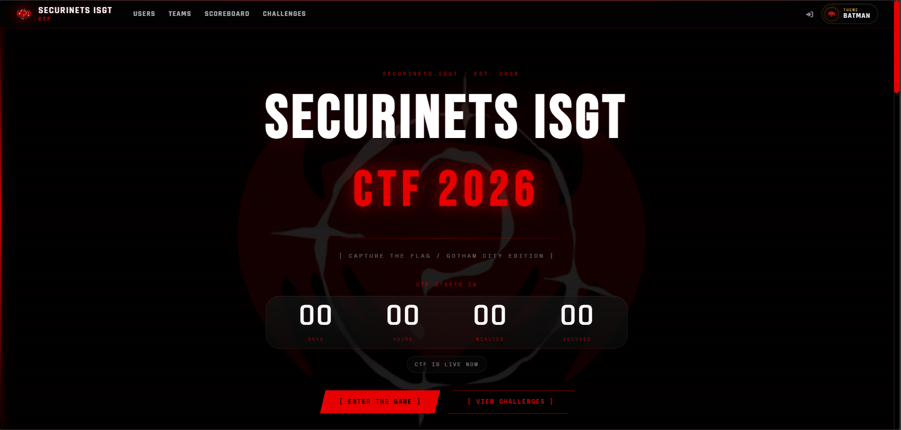
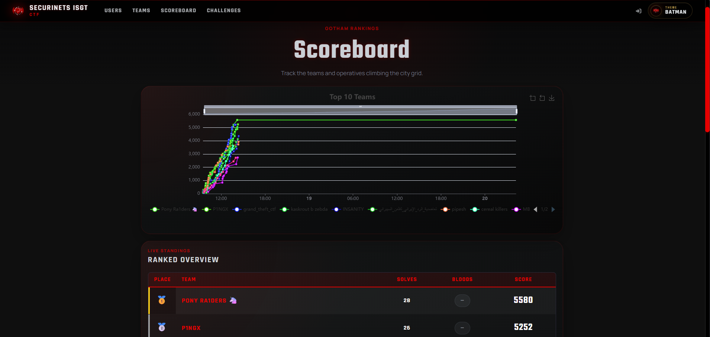
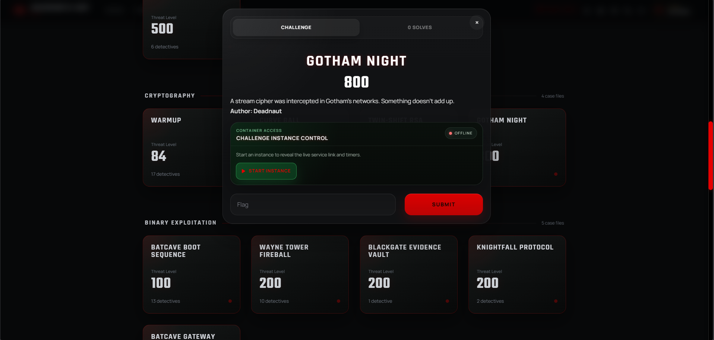

# Securinets ISGT CTF 2026

This repository is a public-safe archive of the CTF platform project.

It keeps the custom Batman/Riddler theme, the backend source, plugins, deployment files, and challenge-related assets, while intentionally excluding runtime data and secrets.

## Repository Structure

- `frontend/`
  - public-safe frontend/theme files
  - custom `hacker` theme source and built static assets
  - standalone reference pages
- `backend/`
  - CTFd source code
  - migrations
  - plugins
  - challenge images
  - Discord first-blood bot source
  - deployment-related files
- `screenshots/`
  - UI screenshots for documentation

## Screenshots

### Home

### Scoreboard

### Challenge Modal

## What Was Removed

The archive is cleaned before publication and does **not** include:

- `.ctfd_secret_key`
- `.flaskenv`
- `CTFd/ctfd.db`
- `CTFd/uploads/`
- `CTFd/logs/`
- `.env` files
- local caches and temp folders
- `node_modules`

## Deployment Instructions

This repo is **not** a GitHub Pages application by itself. GitHub Pages can only host static files, while the real CTFd platform still needs a server.

### 1. Deploy the backend on a VPS

Recommended backend source:

- `backend/CTFd`
- `backend/migrations`
- `backend/conf`
- `backend/challenge-images`
- `backend/services`
- `backend/requirements.txt`
- `backend/requirements.in`
- `backend/manage.py`
- `backend/wsgi.py`

Typical deployment flow:

1. Copy the backend folder contents to the VPS
2. Create a Python virtual environment
3. Install dependencies with `pip install -r requirements.txt`
4. Run database migrations with `flask db upgrade`
5. Serve CTFd with Gunicorn
6. Put Nginx in front of Gunicorn

### 2. Deploy the frontend theme in CTFd

The custom theme lives in:

- `frontend/theme-hacker/`

To use it on a running CTFd deployment:

1. Copy `frontend/theme-hacker/` into `CTFd/themes/hacker/` on the server
2. If you are editing assets, rebuild the theme before deployment
3. Set the active CTFd theme to `hacker`

### 3. Optional bot/service deployment

The Discord first-blood bot source is included in:

- `backend/services/discord-first-blood-bot/`

This should be deployed on a server or challenge host with its own `.env` file and systemd service.

## Notes

- The backend still requires server-side hosting
- The screenshots are included only for documentation
- Review any future deployment additions before pushing publicly
